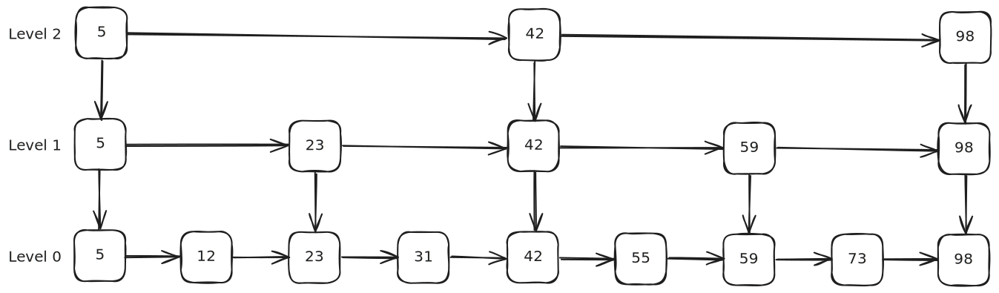

# Algorithms and Data Structures - Skip List

## Characteristics

- Time complexity - Search / Insertion / Deletion:
  - Best: Ω(1)
  - Average: Θ(log n)
  - Worst: O(n) - very rare to happen
- Space complexity: O(n log n)
- Probabilistic Data Structure

## Demos
- [No Duplicates](./src/no_duplicates.py)
- [Allowing Duplicates](./src/allowing_duplicates.py)

## References
- [Other Algorithms & Data Structures](https://github.com/NelsonBN/algorithms-data-structures)
